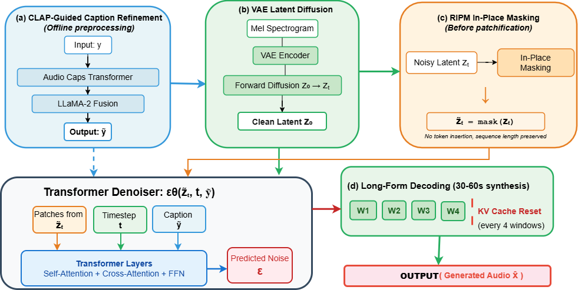

# IP-MDT: In-Place Masked Diffusion Transformer for Text-to-Music Generation

Official implementation of **IP-MDT (In-Place Masked Diffusion Transformer)** for text-to-music generation.

---

## 📄 Abstract

Text-to-music (TTM) generation is hindered by noisy captions, long-form structural drift, and heterogeneous evaluation protocols that impede fair comparison.  
We propose the **In-Place Masked Diffusion Transformer (IP-MDT)**, which induces repair behavior via pre-patchification in-place value masking on the noisy latent \( z_t \), preserving token geometry while leaving the denoiser interface unchanged.  

Quality signals are incorporated exclusively through **Quantile-Calibrated Quality Weighting (QCQW)**, a training-time loss reweighting scheme with no inference-time conditioning pathway.  

We further apply an offline CLAP-guided generate–filter–fuse caption refinement stage and stabilize 30–60 second synthesis using sliding-window decoding with overlap-add blending and periodic KV-cache resets.  

Under a unified, protocol-controlled evaluation on MusicCaps and Song-Describer, IP-MDT consistently improves objective metrics and blinded MUSHRA listening scores over strong baselines.

---

## 🔎 Key Characteristics

- ✅ **Interface-preserving in-place masking (IPM)**
- ✅ **No mask-token insertion**
- ✅ **No quality-token injection**
- ✅ **No inference-time quality conditioning**
- ✅ **Training-only quality reweighting (QCQW)**
- ✅ **Long-form generation (30–60s)** with stabilized decoding
- ✅ **Unified evaluation protocol**

---

## 🏗 Architecture Overview



### Pipeline Summary

1. **Offline Caption Refinement**
   - CLAP-guided generate–filter–fuse process
   - Improves text–audio alignment
   - No inference-time cost

2. **Latent Diffusion Backbone**
   - Waveform → Log-mel → VAE latent
   - Transformer-based denoiser

3. **In-Place Masking (IPM)**
   - Applied on noisy latent \( z_t \) before patchification
   - No token insertion
   - No sequence-length change
   - Applied during training only

4. **QCQW (Quantile-Calibrated Quality Weighting)**
   - Scalar diffusion loss reweighting
   - Uses frozen MOS + CLAP predictors
   - No inference pathway

5. **Long-Form Decoding**
   - Sliding window generation
   - Overlap-add blending
   - Periodic KV-cache resets

---

## 📁 Repository Structure

```

Text-To-Music/
│
├── configs/
├── models/
├── data/
├── train.py
├── generate_music.py
├── evaluate.py
└── ip_mdt.png

````

---

## 📊 Datasets

Experiments follow a unified protocol using:

- **MusicCaps**
- **Song-Describer**

Audio preprocessing:
- 24kHz resampling
- Peak normalization to -1 dBFS
- Loudness normalization to -23 LKFS
- 10.24-second segmentation with 50% overlap

All models share identical dataset splits and evaluation seeds for fair comparison.

---

## 📦 Pretrained Components

Place checkpoints in the following directories (or update paths in `config.yaml`):

### Text Encoder
FLAN-T5 Large  
https://huggingface.co/google/flan-t5-large  
→ `models/flan_t5/`

### CLAP (Training signal only)
https://huggingface.co/lukewys/laion_clap  
→ `models/clap/`

### MOS Predictor (PaSST-based regressor)
Used only for QCQW during training  
→ `models/mos/`

### VAE Checkpoint
Shared latent representation  
→ `models/vae/`

---

## 🚀 Installation

```bash
git clone https://github.com/aiai-9/Text-To-Music.git
cd Text-To-Music
pip install -r requirements.txt
````

---

## 🎵 Generate Music

### Short-form (10.24 seconds)

```bash
python generate_music.py \
  --text "A calm evening with gentle winds." \
  --config configs/ip_mdt.yaml \
  --duration 10.24
```

---

### Long-form (30–60 seconds)

```bash
python generate_music.py \
  --text "An uplifting orchestral cinematic theme." \
  --config configs/ip_mdt.yaml \
  --duration 60 \
  --longform \
  --window_sec 10.24 \
  --overlap 0.5 \
  --kv_reset_every 3
```

---

## 🏋️ Training

```bash
python train.py \
  --config configs/ip_mdt.yaml \
  --dataset_root /path/to/data \
  --train_list data/train.txt \
  --val_list data/val.txt
```

Notes:

* IPM masking is applied during training only.
* QCQW uses frozen predictors.
* Quantile statistics are computed on the training split only.

---

## 📈 Evaluation

```bash
python evaluate.py \
  --config configs/ip_mdt.yaml \
  --ckpt /path/to/checkpoint.pth \
  --test_list data/test.txt
```

### Short-Form Metrics

* FAD
* CLAP (Eval checkpoint)
* Inception Score (IS)
* KL Divergence

### Long-Form Metrics

* Real-Time Factor (RTF)
* Beat F1
* Key stability
* Segment-based FAD

---

## 🎧 Demo & Results

Live Demo:
[https://niranjankumarnk.github.io/Text-to-Music.github.io/](https://niranjankumarnk.github.io/Text-to-Music.github.io/)

Example Outputs:

* Hip Hop: [https://drive.google.com/file/d/1-hdEU_guFy2uO2Ab8-_IKnSBmH41EeB2/view?usp=drive_link](https://drive.google.com/file/d/1-hdEU_guFy2uO2Ab8-_IKnSBmH41EeB2/view?usp=drive_link)
* Jazz: [https://drive.google.com/file/d/1T2tPLJSeZhzLSdonKHwMq6FuR47Lw3-6/view?usp=drive_link](https://drive.google.com/file/d/1T2tPLJSeZhzLSdonKHwMq6FuR47Lw3-6/view?usp=drive_link)
* Random: [https://drive.google.com/file/d/1q1UWs7jk32rVMi2rs7mwNjri6HBRqzhD/view?usp=drive_link](https://drive.google.com/file/d/1q1UWs7jk32rVMi2rs7mwNjri6HBRqzhD/view?usp=drive_link)

---

## 🔬 Reproducibility

We release:

* Training configs
* Evaluation splits
* Prompt grid
* Random seeds
* Checkpoints

All comparisons follow identical:

* Dataset splits
* VAE checkpoint
* Diffusion schedule
* Optimization budget
* Decoding settings

---

## 📄 Citation

```bibtex
@inproceedings{ipmdt2026,
  title={IP-MDT: In-Place Masked Diffusion Transformer for Text-to-Music Generation},
  author={Anonymous Authors},
  booktitle={ICIP},
  year={2026}
}
```

---

## 🙏 Acknowledgements

This project builds upon ideas and infrastructure from:

* AudioLDM2
  [https://github.com/haoheliu/AudioLDM2](https://github.com/haoheliu/AudioLDM2)

---

## 📜 License

MIT License
See `LICENSE` file for details.


